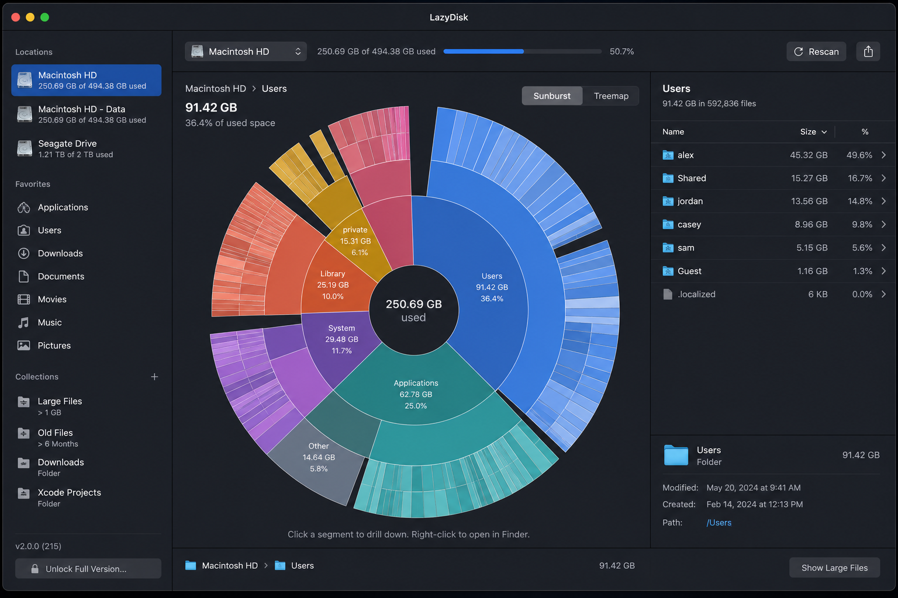
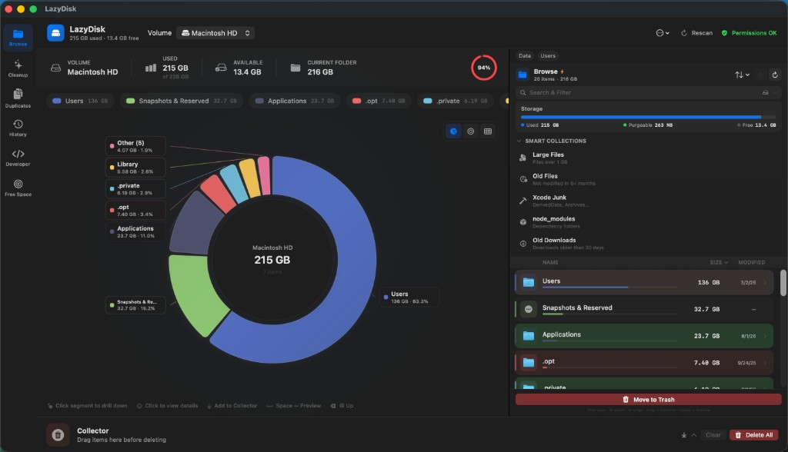
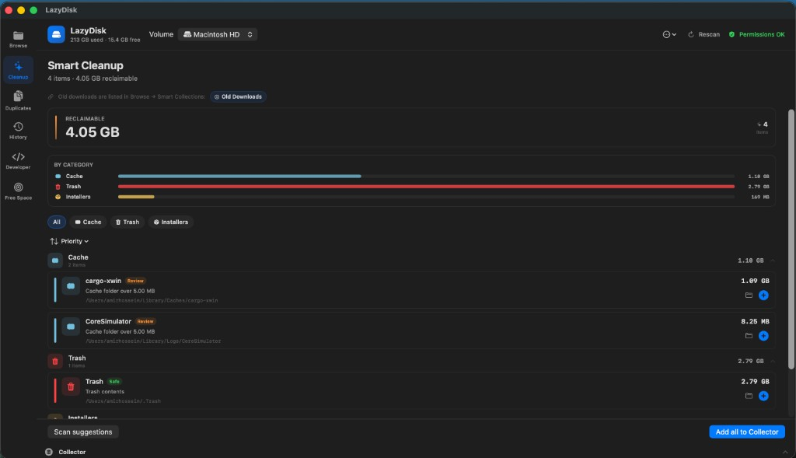
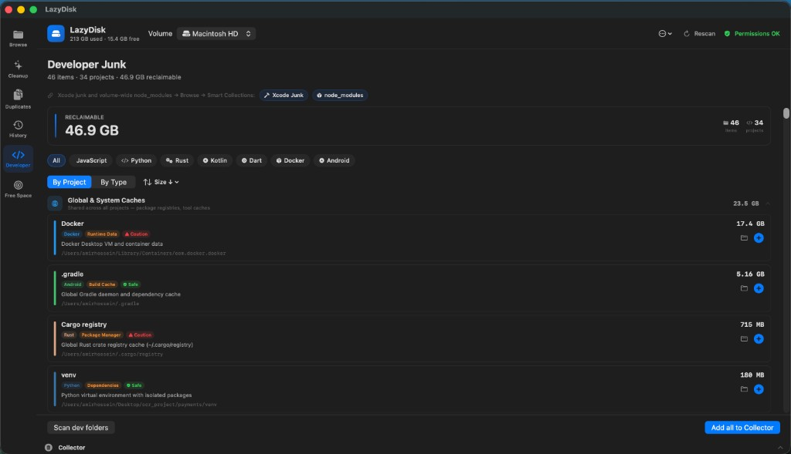

# LazyDisk

A native macOS disk space analyzer and cleanup tool.



| Browse | Smart Cleanup | Developer Junk |
|--------|---------------|----------------|
|  |  |  |

## Features

### Visualization

| Chart | Description |
|-------|-------------|
| **Rose Chart** | Nightingale (polar area) chart — segment area proportional to folder size, click to drill down |
| **Sunburst Chart** | Multi-ring hierarchical chart with animated drill-down and breadcrumb navigation |
| **Treemap Chart** | Rectangular size map with hover highlights and click-to-navigate |
| **Chart styles** | Switch Rose / Sunburst / Treemap from the chart panel or **Display** menu |

All charts share a unified legend, label layout, and keyboard navigation (↑ back, segment selection).

### Browse & navigate

- **Folder browser** — Chart plus sidebar file list with sortable columns (name, size, modified date)
- **Breadcrumbs** — Jump to any ancestor folder; back via ↑ or ⌫
- **Smart Collections** — One-click scans for Large Files, Old Files, Xcode junk, `node_modules`, and Old Downloads
- **Detail panel** — Size, modified/created dates, full path; Quick Look and Collector actions
- **Bookmarks & recent folders** — Quick navigation in the toolbar
- **External volumes** — Scan USB drives and network mounts alongside the system disk
- **iCloud / purgeable breakdown** — Storage header shows used, free, and purgeable space

### Scanning

- **Real-time scanning** — Async parallel directory walks with live size updates in the UI
- **Persistent cache** — Reopen folders without a full rescan when nothing changed
- **Filesystem monitor** — Detects changes and prompts for refresh when files are added or removed
- **Scan progress panel** — Per-folder progress, item counts, and cancel support
- **Scan history** — Snapshots with added / removed / changed diff view

### Cleanup & safety

- **Collector** — Drag items (or ⌘D) into a staging area before deleting; shows projected free space
- **Safe cleanup** — Permanent delete with warnings for protected paths (system, app bundles, etc.)
- **Cleanup panel** — Suggestions for caches, logs, installers, and known junk locations
- **Free Space Goal** — Set a target free-space amount and get ranked suggestions to reach it

### Search

- **Folder search** — Filter by name in the current folder
- **Global volume search** — Three-layer engine: Spotlight → persistent index → live filesystem walk
- **Content filters** — All, Folders, Images, Videos, Audio, Documents, Archives, Apps, Code, Other

### Feature panels

| Panel | Description |
|-------|-------------|
| **Browse** | Chart + sidebar browser, Smart Collections, detail panel |
| **Cleanup** | Cache, logs, installers, and app junk |
| **Duplicates** | Full-file SHA256 duplicate detection across the volume |
| **History** | Scan snapshots with added / removed / changed diff |
| **Developer** | Project junk (`.build`, `__pycache__`, etc.) |
| **Free Space Goal** | Target free space with ranked cleanup suggestions |

### More

- **6 languages** — English, Persian (فارسی), Chinese (中文), French, Arabic (العربية), Turkish — RTL for Persian and Arabic
- **Menu bar widget** — Usage bar, free/used stats, quick open and rescan actions
- **Export** — CSV and JSON export of the current folder from the toolbar menu
- **CLI** — Headless scan, duplicates, cleanup, and dev-junk from Terminal
- **Quick Look** — Space bar preview for selected files
- **Keyboard shortcuts** — Navigation, Collector, rescan, and panel switching

## Requirements

- macOS 13.0 (Ventura) or later
- Swift 5.9+

## Quick start

```bash
git clone https://github.com/DinonowDev/LazyDisk.git
cd LazyDisk
swift build && .build/debug/LazyDisk
```

## Build & run

```bash
# Debug
swift build && .build/debug/LazyDisk

# Release binary
swift build -c release && .build/release/LazyDisk

# .app bundle
./Scripts/build-app.sh
open dist/LazyDisk.app
```

## Tests

```bash
swift test
```

Unit, integration, and filesystem E2E tests cover `LazyDiskCore` logic, CLI parsing, delete-path analysis, localization (6 languages), and headless CLI scans against temp directories.

CI runs `swift build`, `swift test`, and `Scripts/build-app.sh` on macOS via GitHub Actions.

## Download releases

Pre-built `.app` bundles are available on **[GitHub Releases](https://github.com/DinonowDev/LazyDisk/releases)**.

**Latest:** [v1.0.0](https://github.com/DinonowDev/LazyDisk/releases/latest) — `LazyDisk-1.0.0-macos.zip` (macOS 13+, Apple Silicon & Intel)

1. Download the latest release zip.
2. Unzip and open `LazyDisk.app` (right-click → **Open** if Gatekeeper blocks unsigned builds).
3. Optionally clear quarantine: `xattr -cr /path/to/LazyDisk.app`

CI build artifacts are also attached to successful workflow runs under the **Actions** tab.

## Distribution

### Code signing

```bash
CODE_SIGN_IDENTITY="Developer ID Application: Your Name" ./Scripts/build-app.sh
```

The build script bundles `assets/AppIcon.icns`, applies `Scripts/LazyDisk.entitlements`, and supports ad-hoc or Developer ID signing.

### Notarization

Notarization runs automatically when `NOTARIZE_APP=1` and a Developer ID signature is present.

**Option A — keychain profile (recommended):**

```bash
xcrun notarytool store-credentials "lazydisk-notary" \
  --apple-id "you@example.com" \
  --team-id "TEAMID" \
  --password "app-specific-password"

NOTARIZE_APP=1 \
NOTARYTOOL_PROFILE="lazydisk-notary" \
CODE_SIGN_IDENTITY="Developer ID Application: Your Name" \
./Scripts/build-app.sh
```

**Option B — environment variables:**

```bash
NOTARIZE_APP=1 \
APPLE_ID="you@example.com" \
APPLE_APP_SPECIFIC_PASSWORD="xxxx-xxxx-xxxx-xxxx" \
APPLE_TEAM_ID="TEAMID" \
CODE_SIGN_IDENTITY="Developer ID Application: Your Name" \
./Scripts/build-app.sh
```

## CLI

```bash
# Help
.build/debug/LazyDisk --help

# Scan a folder (top 20 items)
.build/debug/LazyDisk --cli --path ~/Downloads

# JSON output
.build/debug/LazyDisk --cli --path / --top 50 --json

# Find duplicates
.build/debug/LazyDisk --cli --duplicates --path ~

# Cleanup suggestions
.build/debug/LazyDisk --cli --cleanup --path /

# Developer junk
.build/debug/LazyDisk --cli --dev --json
```

## Languages

Open **Preferences → Language** to choose:

- System default
- English · فارسی · 中文 · Français · العربية · Türkçe

The UI refreshes immediately; Persian and Arabic use right-to-left layout.

## Full Disk Access

For complete scanning of system folders:

1. **System Settings → Privacy & Security → Full Disk Access**
2. Add `LazyDisk.app` (or Terminal if running via `swift run`)
3. Restart the app

## Finder Quick Action

After building the `.app` bundle (`./Scripts/build-app.sh`), you can analyze any folder from Finder:

1. **Right-click** a folder or file → **Quick Actions** → **Analyze with LazyDisk**  
   (If missing: **System Settings → Privacy & Security → Extensions → Finder** → enable LazyDisk.)
2. Or use **Finder → Services** → **Analyze with LazyDisk**
3. Or from Terminal: `open -a LazyDisk ~/Downloads`
4. Or custom URL: `open lazydisk://open?path=/Users/you/Projects`

LazyDisk opens the Browse panel and navigates to that folder (starting a volume scan first if needed).

## Usage

| Action | How |
|--------|-----|
| Open a folder | Click chart segment or double-click in sidebar |
| View file details | Single-click in sidebar, or click a file in the chart |
| Smart Collection | Sidebar → Smart Collections → pick a collection |
| Switch chart style | Segmented control above chart, or **Display** menu |
| Go back | Breadcrumbs, ↑, or ⌫ |
| Add to Collector | Drag, ⌘D, or context menu |
| Delete | Collector or selection → Delete permanently |
| Global search | Toggle **Entire volume** in search bar |
| Switch panel | Left sidebar icons (Cleanup, Duplicates, …) |
| Export | Toolbar ⋯ menu → CSV / JSON |
| Rescan | Toolbar ↻ or ⇧⌘R |

## Architecture

```
Sources/LazyDiskCore/     Shared models & utilities (testable, no UI)
Sources/LazyDisk/         macOS app (SwiftUI, services, views)
Tests/LazyDiskTests/      Unit tests against LazyDiskCore
```

## Contributing

See **[CONTRIBUTING.md](CONTRIBUTING.md)** for:

- Local setup and development workflow
- Running tests and building the `.app` bundle
- Code signing and notarization
- Downloading releases and CI artifacts
- Commit message conventions and pull request guidelines

## Support

LazyDisk is free and open source. If you find it useful, consider supporting development:

| Network | Address |
|---------|---------|
| **TRON (TRC-20)** | `TAcW3UvfPF95Higtyjo133rAAx51Ru8VhB` |
| **Polygon** | `0xF8Ebe674D471cBc5fF9924bE85829090364F4318` |
| **Ethereum** | `0xF8Ebe674D471cBc5fF9924bE85829090364F4318` |
| **Bitcoin** | `0xF8Ebe674D471cBc5fF9924bE85829090364F4318` |

In the app: **Help → Donate…** (or **LazyDisk → Donate…**), or tap **Support the project** on the welcome screen.

## License

MIT — see [LICENSE](LICENSE).
